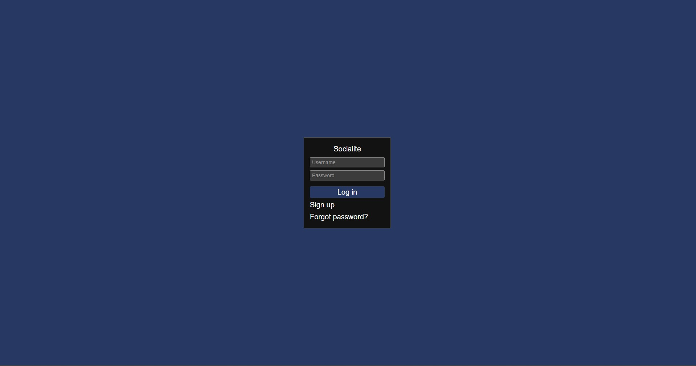
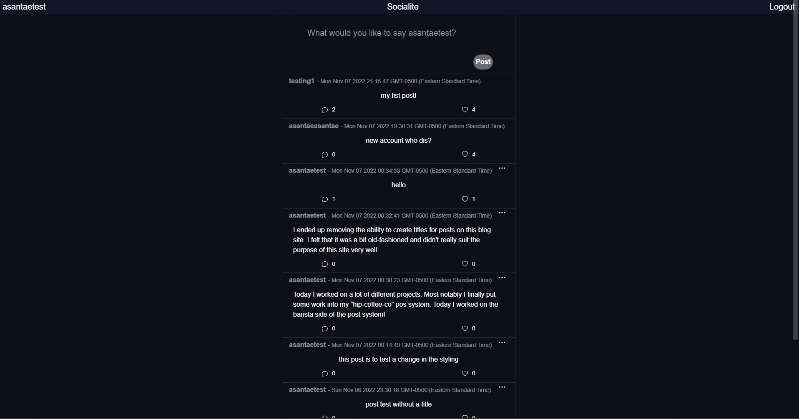
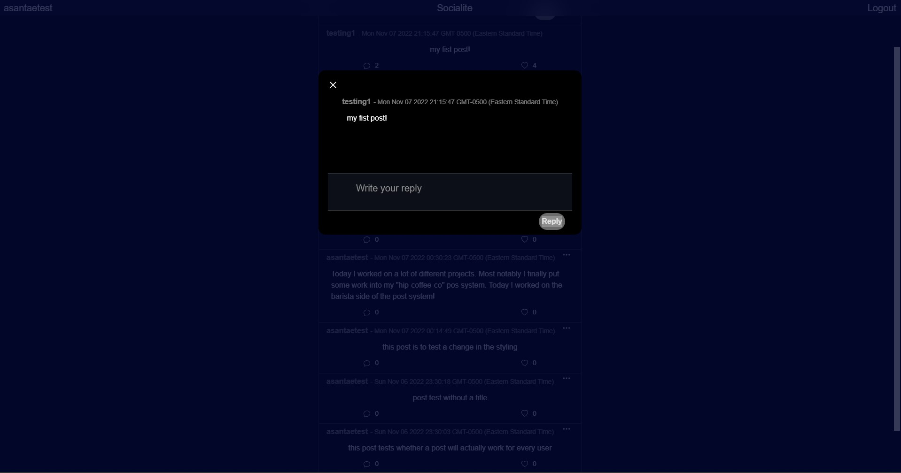

# Install

`npm install` or `npm i`

---

# Things to add

- Create a `.env` file in config folder and add the following as `key = value`
  - PORT = 8000
  - SESSION_SECRET = (session secret key)
  - DB_STRING = `your database URI`
  - CLOUD_NAME = `your cloudinary cloud name`
  - API_KEY = `your cloudinary api key`
  - API_SECRET = `your cloudinary api secret`

---

# Run

`npm run dev`

# Notes about dev environment
I am using connect-mongo version 3. the most recent version does not support how we are currently implementing new sessions

# Screenshots

